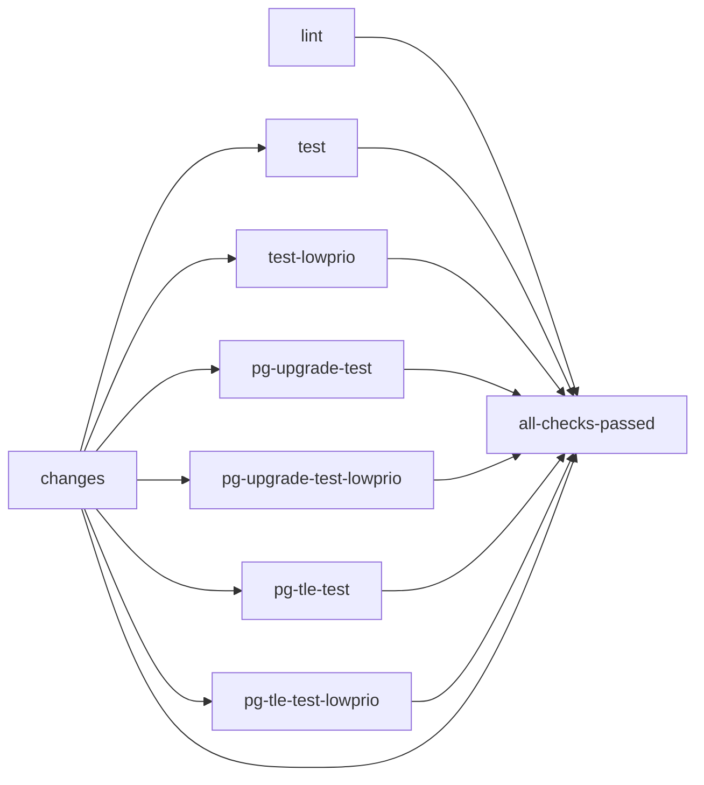
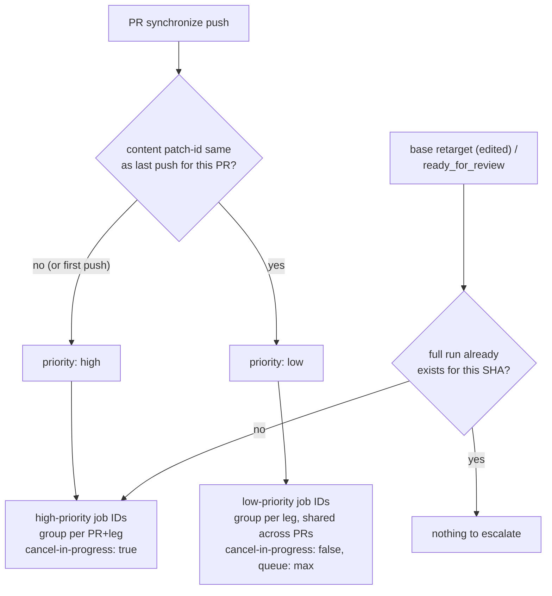

# CI workflows

Orientation for `ci.yml` (and `claude-code-review.yml`) - the high-level shape
only. Each file's own inline comments carry the detailed rationale; this
doc exists so a first-time reader isn't starting from zero.

## `ci.yml` jobs

| Job | Proves |
| --- | --- |
| `changes` | Cheap gate: is this push docs-only? What's the supported PostgreSQL major list (from `META.json`)? Is this push high- or low-priority (see below)? |
| `lint` | `make lint` - SQL style, always runs in full. |
| `test` / `test-lowprio` | Fresh `CREATE EXTENSION` + in-place `ALTER EXTENSION UPDATE`, across every supported PostgreSQL major. |
| `pg-upgrade-test` / `-lowprio` | A REAL binary `pg_upgrade` between the oldest and newest supported majors, both update-vs-upgrade orderings. |
| `pg-tle-test` / `-lowprio` | Fresh install and update, both deployed purely via AWS pg_tle's catalog (no filesystem `.control` file). |
| `all-checks-passed` | Single stable required-status-check name; passes iff every job above passed or was legitimately skipped. |

## Docs-only gate

`changes` diffs the push's changed files (`bin/docs_only_diff`); if every
changed file is `.md`/`.asc`, the heavy jobs (`test*`, `pg-upgrade-test*`,
`pg-tle-test*`) skip themselves via `if: needs.changes.outputs.docs_only !=
'true'`. `lint` and `changes` itself always run, so `all-checks-passed`
never gets stuck pending on a doc-only push.

## Draft PRs

While a PR is a draft: `lint` runs in full, `test`'s matrix drops to just
the newest PostgreSQL major (still real signal, cheap), and
`pg-upgrade-test`/`pg-tle-test` are skipped entirely. Marking the PR
`ready_for_review` retriggers a full run immediately.

## Priority lanes (rebase-cascade pushes vs. real work)

A `gh stack rebase` pushes to every PR above the one actually being
changed, purely to move it onto a new base - the PR's own diff doesn't
change. Running that at the same priority as genuine new commits lets a
burst of cascade pushes crowd out runner capacity that active work needs.

`changes` tells the two apart with a base-independent content hash
(`bin/patch_id_hash`, compared/persisted per-PR via `bin/ci_priority` +
`actions/cache`): a `synchronize` push whose hash matches the last one
seen for this PR is a pure rebase cascade -> `priority: low`. Everything
else, including this PR's first push, is `priority: high`.

`test`, `pg-upgrade-test`, and `pg-tle-test` each exist as TWO job IDs
(e.g. `test` / `test-lowprio`), not one job with a priority-conditional
`concurrency:` block - `queue: max` (letting up to 100 runs queue in a
concurrency group instead of cancelling all but one) cannot combine with a
`cancel-in-progress` that could evaluate `true` at runtime, so the
low-priority side needs a literal, unconditional `cancel-in-progress:
false` living in a job a real push can never enter:

- **High-priority** job: `if: priority != 'low'`, concurrency group keyed
  per-PR-per-matrix-leg, `cancel-in-progress: true`. Behaves exactly like
  before there were two job IDs.
- **Low-priority** job: `if: priority == 'low'`, concurrency group keyed
  by the **matrix leg alone** (e.g. `ci-test-lowprio-<pg>`) - shared
  across every PR's low-priority pushes for that same leg, repo-wide -
  `cancel-in-progress: false`, `queue: max`. Each leg of a single push
  still queues independently, so a whole push's matrix isn't collapsed
  onto one shared slot; it just competes only with other low-priority
  runs of that exact same leg, never with real work.

Either way, the full matrix still eventually runs - a rebase CAN break
something the diff itself didn't touch, and this repo won't merge without
a clean run regardless.

### Escalation

A base retarget (the signal `gh stack` sends when a PR is promoted to the
bottom of its stack, the next one due to merge) or `ready_for_review`
bypasses whatever priority its last push landed in and forces an
immediate high-priority run - unless a full `all-checks-passed` run
already exists for that exact head SHA (`bin/check_run_exists`), in which
case there's nothing to gain by re-running it.

## `claude-code-review.yml`

Runs Claude's PR review via `pull_request_target`, gated to PRs authored
by the maintainer (secret-bearing job). It has its own, independent
content-check (same `bin/patch_id_hash` cache namespace as `ci.yml`'s
`changes` job) that skips the review outright on a rebase-cascade push -
it doesn't use `ci.yml`'s priority/lane mechanism at all, since there's
nothing to "queue", only skip or run.
